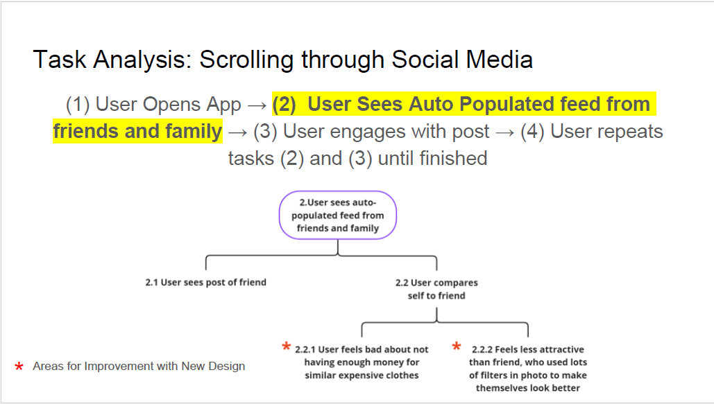
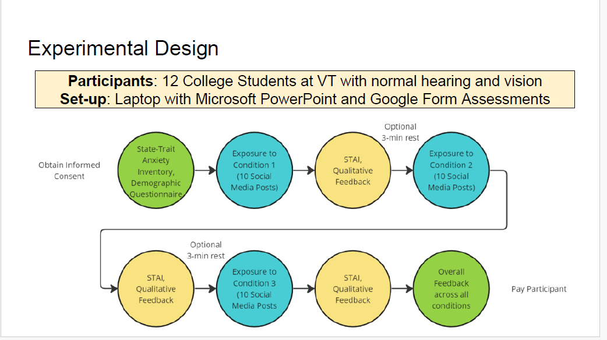
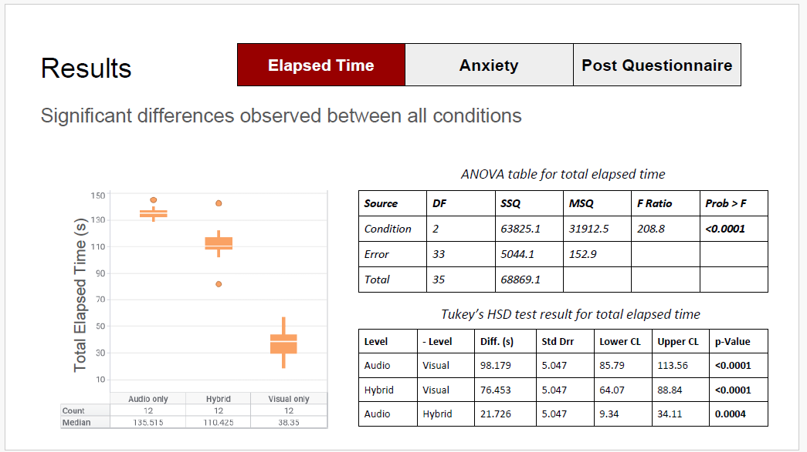
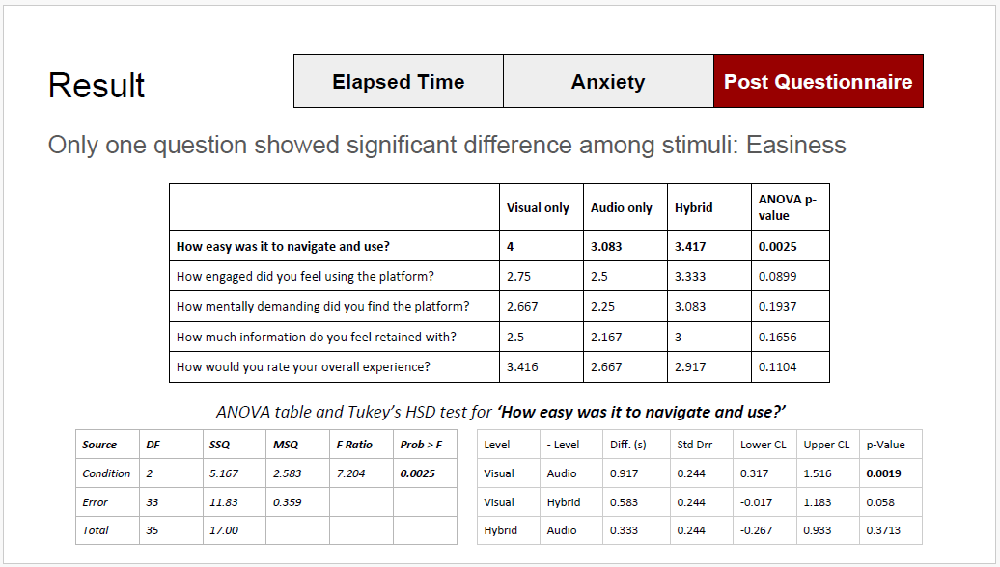

[← Back to Portfolio](/portfolio/)

# User Experience Research for Audio-Based Social Media
## The Effects of an Audio-Based Modality on Social Media Experience

---

## Overview
**Context.** This project explores whether changing how social media content is presented can reduce some of the downsides of visual-first feeds. Visual platforms often encourage rapid scanning and comparison, 
especially around appearance and perceived status so we investigated an audio-based alternative that could preserve social connection while reducing comparison-driven effects.

We designed an audio-based social media experience and evaluated it in a controlled within-subject study (n=12), comparing visual-only, audio-only, and hybrid (audio + visual) conditions. 
We measured efficiency (time-on-task), anxiety-related outcomes (STAI), and post-task usability/experience ratings to understand where audio interaction helps, where it adds friction, and 
what design requirements would make an audio-first feed viable.

[Read the full project report (PDF)](/portfolio/assets/audio-social/audio-social-media-paper.pdf)

**Goal.** Design and evaluate an audio-based social media experience and test two core questions:

1. Does using an audio-based social media modality lead to less anxiety than a traditional visual modality?
2. Is an audio-based modality as satisfying and usable as a visual-based modality?
   
To answer this, we ran a within-subject lab study (n=12) comparing visual-only, audio-only, and hybrid (audio + visual) conditions, using time-on-task and standardized/self-report measures (including STAI and post-task usability ratings) to quantify tradeoffs across modalities.

**My role.** Study execution support, materials preparation, results synthesis, and translating findings into design implications and next-step recommendations.

**Participants.** 12 college students  
**Study design.** Within-subject, counterbalanced (Visual / Audio / Hybrid)

---

## Study Design (Methods)
- In-lab sessions (~1 hour) with consent and questionnaires
- Exposure to ~10 posts per condition (self-paced)
- Measures: elapsed time, STAI, post-questionnaire (ease, engagement, mental demand, etc.)

### Task analysis + Experimental flow
| Task analysis | Experimental flow |
|---|---|
|  |  |

---

## Key Findings
1. **Efficiency:** Elapsed time differed significantly across conditions (**visual fastest**, **audio slowest**, **hybrid in-between**).
2. **Anxiety (STAI):** No statistically significant differences observed across modalities.
3. **Usability:** The only post-questionnaire item with a significant difference was **ease of navigation** (visual rated higher than audio).
4. **Preference:** Participants generally preferred visual; audio was viewed as situationally useful (e.g., multitasking/accessibility).

### Results snapshots
| Time results | Post-questionnaire results |
|---|---|
|  |  |

---

## Human Factors Interpretation
- **Processing cost:** Audio-only browsing increases time/processing load because users can’t visually scan; hybrid reduces this cost via quick gist extraction.
- **Null anxiety finding:** The stimuli/context may not have induced negative affect strongly enough; future work should recruit users with reported negative social media impacts and/or use more targeted stimuli.

---

## Design Implications (Next iteration)
- Add **playback speed** and **summary vs. full narration** controls to support different attention contexts.
- Improve audio navigation patterns (**skip/rewind/quick-jump**) to reduce friction relative to visual scanning.
- Move to a higher-fidelity prototype to reduce novelty effects and evaluate more realistic behavior.

---

## Artifacts (available on request)
Recruitment email (redacted), study scripts/conditions, IRB-approved consent process (not shared publicly), slides and report.

---

*Last updated: 2026*

